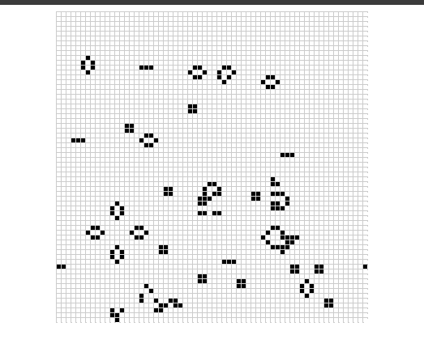

# Rust WebAssembly



This is an implementation of the game of life using Rust and WebAssembly. For more information see [the rust wasm guide](https://rustwasm.github.io/docs/book/).

## To run the project

Build the WASM with wasm-pack (download it [here](https://rustwasm.github.io/wasm-pack/installer/)).

```
wasm-pack build
```

Intall npm-dependencies and start dev server

```
cd .\webapp
npm install
npm run dev
```
